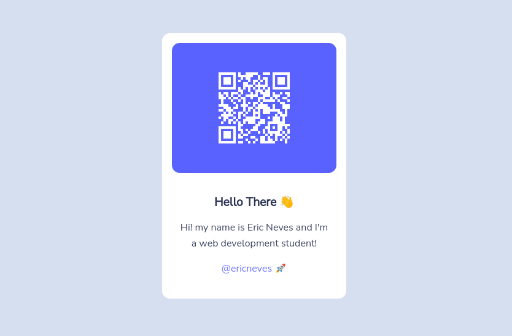

#### QRcode Project 🚀 

 

<p>Projeto simples proposto pela plataforma <a href="https://www.frontendmentor.io/">Frontend Mentor</a>. Neste projeto algumas features foram implementadas juntamente com o uso do Webpack, Babel, da biblioteca QRCode e entre outros.</p>

<p>Solução: https://www.frontendmentor.io/solutions/qr-code-component-CyOyGF1nxN</p>



#### Executando ⚙️

```sh
# Website: https://qrcoderq.netlify.app/

# Clone
$ git clone 

# Install Dependencies
$ cd QRCode && npm install

# Execute
$ npm start
# Run mode development 
$ npm run dev
# Build
$ npm run build
```

#### Ferramentas 🛠

   * HTML5
   * CSS3
   * Javascript
     * QRCode
   * NodeJS
     * Express
     * Webpack
     * Babel

#### License

